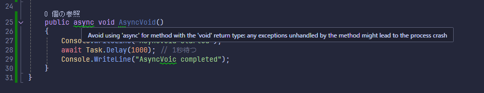

# Async1

async void / async Task の調査

警告

Avoid using 'async' for method with the 'void' return type: any exceptions unhandled by the method might lead to the process crash

async'を'void'戻り値のメソッドに使用するのは避けること。
メソッドで処理されなかった例外は、プロセスのクラッシュにつながる可能性があります。

